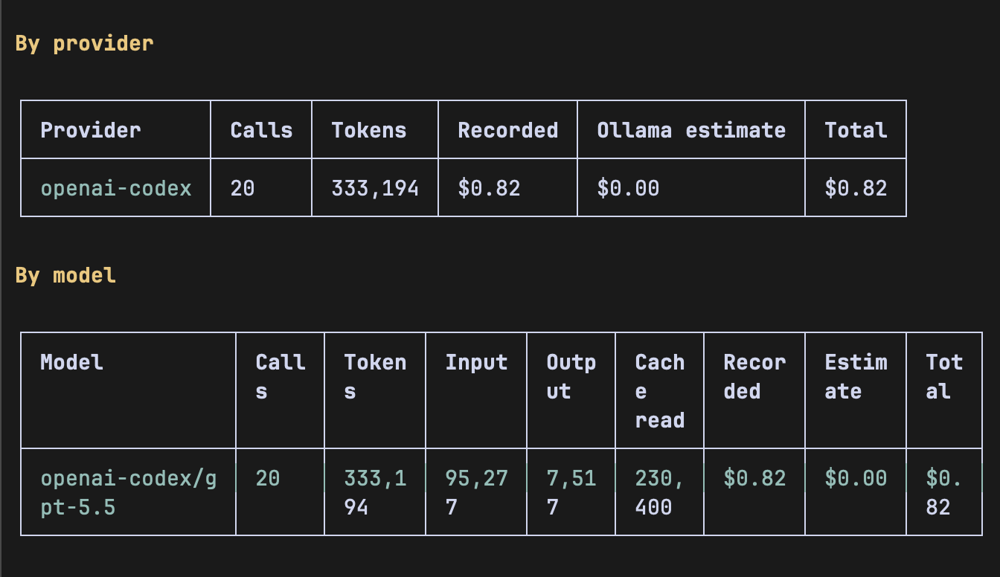
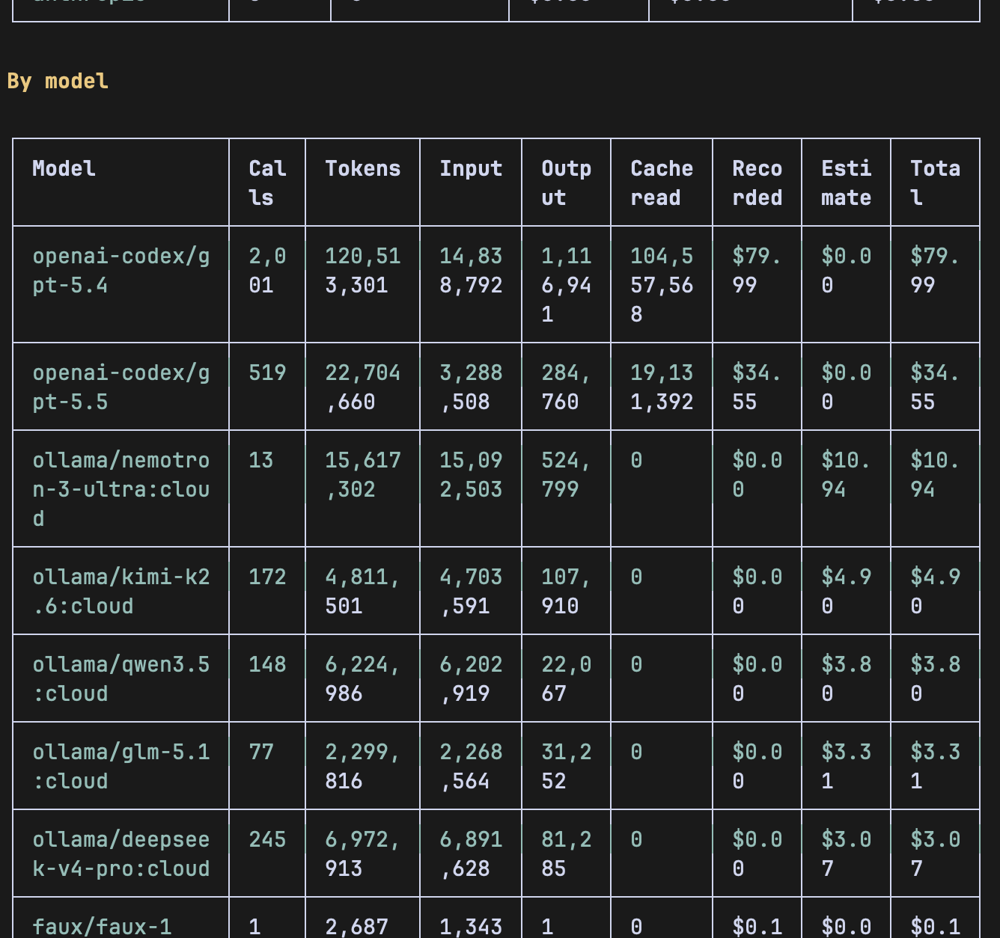

# pi-repo-spend

A Pi extension that reports how much money and how many tokens you have spent per repo, provider, and model.

It reads Pi's local JSONL session logs from `~/.pi/agent/sessions`, aggregates usage, and shows a Markdown report inside Pi.

## Extension name

`pi-repo-spend`

## Slash command

```text
/repo-spend
```

## What it shows

- Total token usage
- Total recorded cost from Pi logs
- Estimated Ollama Cloud cost when Pi records Ollama as `$0`
- Cost by provider
- Cost by model
- Cost by repo/cwd when scanning all sessions

## Screenshots

Example output for the current repo/session:



Example output for all Pi sessions grouped by repo/cwd:



## Commands

```text
/repo-spend       # current git repo; includes sessions in repo subdirectories
/repo-spend cwd   # only sessions whose cwd exactly matches the current cwd
/repo-spend all   # all Pi sessions, grouped by repo/cwd
```

In `/repo-spend all`, the report includes a table like:

| Repo / cwd | Sessions | Calls | Tokens | Recorded | Ollama estimate | Total | Top model |
|---|---:|---:|---:|---:|---:|---:|---|
| `my-repo (/path/to/my-repo)` | 3 | 120 | 1,234,567 | `$4.20` | `$0.12` | `$4.32` | `openai-codex/gpt-5.5` |

## Run once

```bash
pi -e /Users/nileshteji/aibot/pi-repo-spend
```

Then use:

```text
/repo-spend
```

## Install as a local Pi package

```bash
pi install /Users/nileshteji/aibot/pi-repo-spend
```

Then restart Pi or run:

```text
/reload
```

## Cost logic

- For providers where Pi records `usage.cost.total`, this extension uses the recorded cost.
- For Ollama Cloud, Pi often records `$0`; this extension estimates the cost from a hardcoded pricing table.
- Ollama estimates are shown separately as `Estimated Ollama Cloud cost`.

## Hardcoded Ollama Cloud estimate rates

Ollama Cloud itself bills by subscription/cloud usage, primarily GPU time, not fixed token prices. These estimates use equivalent provider API prices for the same or nearest public model.

| Ollama model | Input / 1M | Output / 1M | Cache read / 1M | Source basis |
|---|---:|---:|---:|---|
| `deepseek-v4-pro:cloud` | `$0.435` | `$0.87` | `$0.003625` | DeepSeek official API pricing |
| `glm-5.1:cloud` | `$1.40` | `$4.40` | `$0.26` | Z.AI official pricing |
| `kimi-k2.6:cloud` | `$0.95` | `$4.00` | `$0.16` | Kimi official pricing |
| `minimax-m3:cloud` | `$0.30` | `$1.20` | `$0.06` | MiniMax standard discounted tier, <=512k input |
| `qwen3.5:cloud` | `$0.60` | `$3.60` | `$0.60` | Qwen3.5 public API estimate |
| `nemotron-3-ultra:cloud` | `$0.60` | `$3.60` | `$0.20` | NVIDIA/Together route estimate |

Treat Ollama numbers as practical estimates, not your Ollama invoice.

## Files

| File | Purpose |
|---|---|
| `index.ts` | Pi extension entry point and scanner implementation |
| `package.json` | Pi package manifest |
| `README.md` | Project documentation |
| `context.md` | Short context for future agents |

## Notes

- The extension does not call external APIs at runtime.
- It only reads local Pi session logs.
- It respects `PI_CODING_AGENT_SESSION_DIR` and `PI_CODING_AGENT_DIR` when set.
